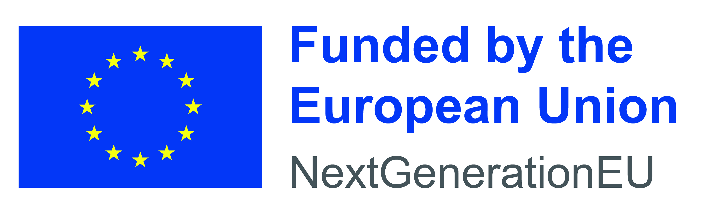

# MitoTex

This is the website of project **MitoTex: Unlocking the secrets of mitochondrial networks with texture descriptors**,
funded by the EU NextGenerationEU through the Recovery and Resilience Plan for Slovakia under the project No. 09I03-03-V04-00363.

Duration: October 2024 - August 2026

PI: [Dr. Jiří Hladůvka](mailto:jiri.hladuvka@fmph.uniba.sk)

## News
- **`2026-03-06`** [IEEE ISBI 2026](https://biomedicalimaging.org/2026/) paper selected for an oral presentation — a significant achievement, congratulations!

- **`2026-01-13`** [IEEE ISBI 2026](https://biomedicalimaging.org/2026/) paper accepted — congratulations to both authors!

- **`2026-01-01`** Matúš Kočalka joined the project. Welcome. 

- **`2025-11-26`** Poster presented at [MatFyz Connections 2025](https://fmph.uniba.sk/microsites/connections-fmfi/).

<!-- - **`2026-11-07`** Paper on dihedral invariant LBP co-occurrence submitted to [IEEE ISBI 2026](https://biomedicalimaging.org/2026/) -->

- **`2025-09-28`** Paper at **ITAT** as an oral presentation.

- **`2025-09-03`** Xénia Richnáková joined the project.  

- **`2025-08-05`** Paper accepted for publications and talk at [ITAT](https://itat.ics.upjs.sk/) (Information technologies - Applications and Theory).

<!-- - **`2025-07-04`** Paper on segmentation submitted to [ITAT](https://itat.ics.upjs.sk/) -->
- **`2025-04-30`** Received new microscopy scans from the [Faculty of Natural Sciences](https://fns.uniba.sk/en/).  

<!-- - **`2024-MM-DD`** New RPBP assigned -->
- **`2025-03-27`** Presented the project during the [CompBio group](https://compbio.fmph.uniba.sk) retreat in Richňava.  

- **`2024-12-09`** Assigned a new diploma thesis to a student: *Textural descriptors for quantification of mitochondrial states.*  

- **`2024-12-09`** Presented structural entropy sub-problems at the seminar of the Computer Graphics and Vision Group.  

- **`2024-11-27`** Researchers from the [Faculty of Natural Sciences](https://fns.uniba.sk/en/) committed to join the initiative.    An informal meeting with [Prof. RNDr. Ľubomír Tomáška, DrSc.](https://fns.uniba.sk/tomaska/) and [Prof. RNDr. Jozef Nosek, DrSc.](http://www.biocenter.sk/jn.html) sparked their interest in **MitoTeX** and motivated them to contribute future microscopy scans.

## Publications

- Xénia Richnáková, Matúš Kočalka, Viktória Hodorová, and Jiří Hladůvka.
MitoTex: Texture-based analysis of mitochondrial microscopy, Poster presented at MatFyz Connections, 2025. [`BibTeX`](Connections.bib)

- Xénia Richnáková, Viktória Hodorová, and Jiří Hladůvka.
Brightfield Cell Segmentation Without Labels or Learning. In Proceedings of Information Technologies - Applications and Theory, 228-237, 2025. [`BibTeX`](ITAT.bib)

<html>
 
 
</html>
